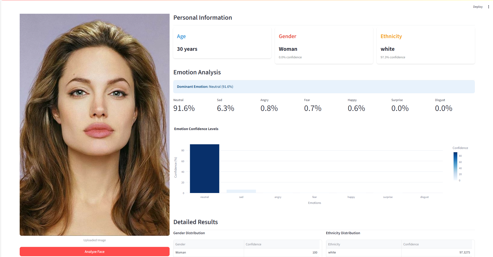

# 🎯 Face Analysis App



Une application d'analyse faciale moderne construite avec Streamlit et DeepFace pour analyser l'âge, le genre, l'origine ethnique et les émotions.


## 📋 Table des Matières

- [Fonctionnalités](#fonctionnalités)
- [Technologies Utilisées](#technologies-utilisées)
- [Installation](#installation)
- [Structure du Projet](#structure-du-projet)
- [Exemples](#exemples)

## ✨ Fonctionnalités

- **🎂 Estimation d'Âge** : Prédiction de l'âge avec précision
- **👤 Détection de Genre** : Identification homme/femme avec niveaux de confiance
- **🌍 Analyse Ethnique** : Classification multi-classes (6 catégories)
- **😊 Reconnaissance d'Émotions** : 7 émotions (joie, tristesse, colère, surprise, peur, dégoût, neutre)
- **📊 Visualisations** : Graphiques interactifs avec Plotly

## 🛠 Technologies Utilisées

| Technologie   | Version | Description                        |
| ------------- | ------- | ---------------------------------- |
| **Python**    | 3.7+    | Langage de programmation principal |
| **Streamlit** | 1.47+   | Framework d'application web        |
| **DeepFace**  | 0.0.93+ | Bibliothèque d'analyse faciale IA  |
| **Plotly**    | 5.0+    | Visualisations interactives        |
| **Pandas**    | 2.3+    | Manipulation de données            |
| **Pillow**    | 11.3+   | Traitement d'images                |

## 🚀 Installation

1. **Cloner le repository**

```bash
git clone <repo-url>
cd face_rec
```

2. **Créer un environnement virtuel** (recommandé)

```bash
python -m venv venv
source venv/bin/activate  # Linux/Mac
# ou
venv\Scripts\activate     # Windows
```

3. **Installer les dépendances**

```bash
pip install -r requirements.txt
```

4. **Lancer l'application**

```bash
streamlit run app.py
```

5. **Ouvrir dans le navigateur** : http://localhost:8501

## 📁 Structure du Projet

```
face_rec/
│
├── app.py                 # Application Streamlit principale
├── requirements.txt       # Dépendances Python
├── README.md             # Documentation
├── .gitignore           # Fichiers à ignorer par Git
│
└── venv/                # Environnement virtuel (non versionné)
```

## 💡 Exemples

### Exemple de Résultat JSON

```json
{
  "age": 28,
  "dominant_gender": "Woman",
  "gender": {
    "Woman": 89.2,
    "Man": 10.8
  },
  "dominant_race": "asian",
  "race": {
    "asian": 67.1,
    "white": 18.9,
    "middle eastern": 8.2,
    "indian": 3.1,
    "latino hispanic": 1.9,
    "black": 0.8
  },
  "dominant_emotion": "happy",
  "emotion": {
    "happy": 78.3,
    "neutral": 12.1,
    "surprise": 5.2,
    "sad": 2.1,
    "angry": 1.8,
    "fear": 0.3,
    "disgust": 0.2
  }
}
```

---

**Développé par** : **Yassine Kamouss**  
**Version** : 1.0.0 | **Dernière mise à jour** : Juillet 2025
